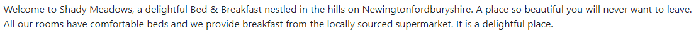

*** Practicas de curso de automatizacion en cypress Agosto/2024 ***

## Actividad para el 15/08

-  Visita https://automationintesting.online/ para realizar la actividad.
-  Implementa los siguientes métodos de Cypress que hemos revisado:

-  Verifica que la información del hotel esté presente en la página.

-  Asegurate de que haya al menos una imagen visible.

-  Confirma que el texto de la descripción del hotel sea el esperado.
    

    

-  Crea comandos personalizados para reutilizar el código (basado en el código proporcionado).
-  Desarrolla al menos dos ejemplos que interactúen con APIs.
-  Reportar los bugs/improvments encontrados en Trello utilizando la planilla de reporte de bug proporcionada en clase:
    
    [Template reporte de bugs](https://www.notion.so/Template-reporte-de-bugs-364ceff6759f498f9fff725fe45e5ead?pvs=21)
    

Código de ejemplo (ver codigo)

Deben subir el codigo a un repositorio de Github y compartir el repositorio PUBLICO en la actividad del canvas.